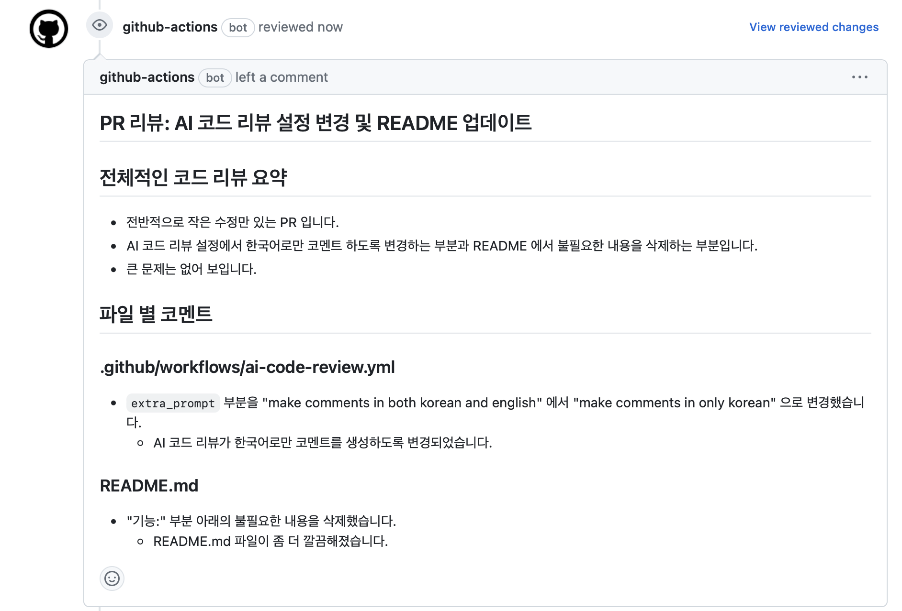

## Ko-gemini-code-review-action

Gemini AI로 풀 리퀘스트를 리뷰하는 컨테이너 GitHub Action.

Pull requests(이하 PR)의 크기가 Gemini API의 최대 청크 크기를 초과할 경우, 이 Action은 PR를 여러 청크로 분할하여 각 청크에 대한 리뷰 댓글을 생성합니다. 그런 다음 Action은 리뷰 댓글을 요약하여 PR에 리뷰 댓글로 게시합니다.

## 사전 요구 사항

Gemini API를 사용하기 위해 GitHub Actions 비밀 GEMINI_API_KEY를 설정하여 Action에 안전하게 전달해야 합니다.

## 입력 값

깃허브 액션에 직접 추가

`gemini_api_key`: Gemini API에 접근하기 위한 Gemini API 키 (API 키 받기).


----

직접 추가할 필요 없음 

`github_token` : GitHub API에 접근하기 위한 GitHub 토큰 (이 토큰을 생성할 필요는 없습니다!).

`github_repository`: 리뷰 댓글을 게시할 GitHub 리포지토리.

`github_pull_request_number`: 리뷰 댓글을 게시할 GitHub 풀 리퀘스트 번호.

`git_commit_hash`: 리뷰 댓글을 게시할 git 커밋 해시.

`pull_request_diff`: 리뷰 댓글을 생성하기 위한 풀 리퀘스트의 diff.

`pull_request_diff_chunk_size`: 리뷰 댓글을 생성하기 위한 풀 리퀘스트 diff의 청크 크기.

`extra_prompt`: 리뷰 댓글을 생성하기 위한 추가 프롬프트.

`model: 리뷰 댓글을 생성하기 위한 모델. 사용 가능한 모델을 사용할 수 있습니다.

`log_level`: 로그를 출력할 로그 레벨.

Gemini 모델은 최대 입력 토큰 수에 제한이 있다는 것을 알고 있을 것입니다.

따라서 diff의 크기가 제한을 초과할 경우, 풀 리퀘스트의 diff를 여러 청크로 분할해야 합니다.

사용하는 모델에 따라 청크 크기를 조정할 수 있습니다.

## 사용 예시

리포지토리의 PR를 리뷰하기 위해 Action을 사용하는 예시는 다음과 같습니다.
실제 파일은 .github/workflows/ai-code-review.yml에 위치해 있습니다.
우리는 Python 개발자의 관점에서 Gemini AI가 풀 리퀘스트를 리뷰하도록 목표합니다.

Action 실행 결과, Action은 다음 이미지와 같이 PR에 리뷰 댓글을 게시합니다.


```yaml
name: "Code Review by Gemini AI"

on:
  pull_request:

jobs:
  review:
    runs-on: ubuntu-latest
    permissions:
      contents: read
      pull-requests: write
    steps:
      - uses: actions/checkout@v3
      - name: "Get diff of the pull request"
        id: get_diff
        shell: bash
        env:
          PULL_REQUEST_HEAD_REF: "${{ github.event.pull_request.head.ref }}"
          PULL_REQUEST_BASE_REF: "${{ github.event.pull_request.base.ref }}"
        run: |-
          git fetch origin "${{ env.PULL_REQUEST_HEAD_REF }}"
          git fetch origin "${{ env.PULL_REQUEST_BASE_REF }}"
          git checkout "${{ env.PULL_REQUEST_HEAD_REF }}"
          git diff "origin/${{ env.PULL_REQUEST_BASE_REF }}" > "diff.txt"
          {
            echo "pull_request_diff<<EOF";
            cat "diff.txt";
            echo 'EOF';
          } >> $GITHUB_OUTPUT
      - uses: rubensflinco/gemini-code-review-action@1.0.5
        name: "Code Review by Gemini AI"
        id: review
        with:
          gemini_api_key: ${{ secrets.GEMINI_API_KEY }}
          github_token: ${{ secrets.GITHUB_TOKEN }}
          github_repository: ${{ github.repository }}
          github_pull_request_number: ${{ github.event.pull_request.number }}
          git_commit_hash: ${{ github.event.pull_request.head.sha }}
          model: "gemini-1.5-pro-latest"
          pull_request_diff: |-
            ${{ steps.get_diff.outputs.pull_request_diff }}
          pull_request_chunk_size: "3500"
          extra_prompt: |-
            Reviwe the code in Korean.
          log_level: "DEBUG"
```
